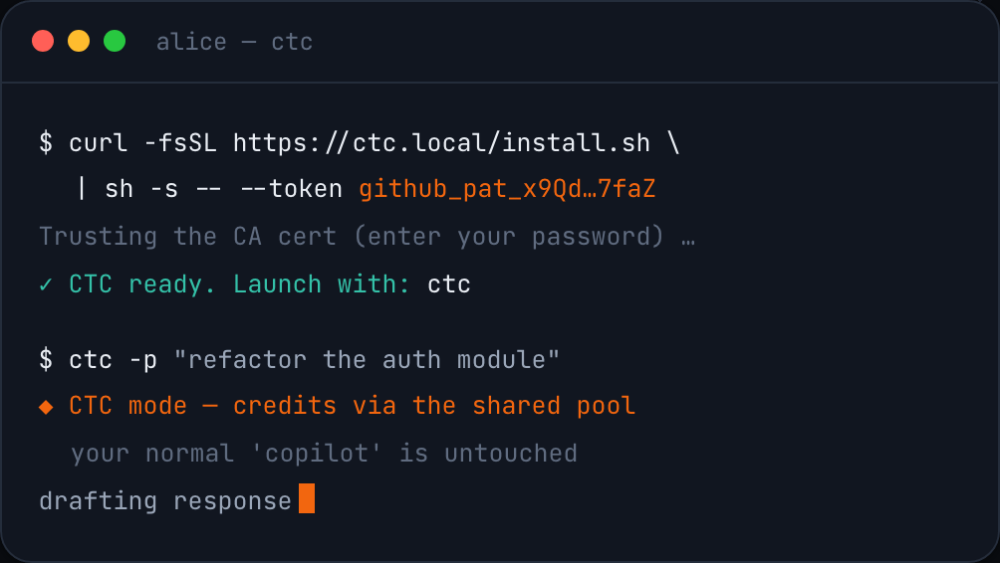
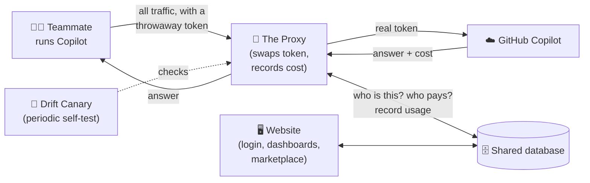
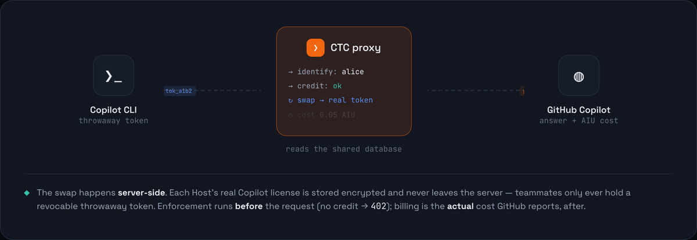

# CTC — Community Token Credit

<p align="center">
  
</p>

> **New here? This page is the 2-minute version.** When you want more, the
> [**Guide**](docs/guide/) goes deeper one layer at a time — like peeling an
> onion. You never have to read more than you need.

---

## What is CTC, in one sentence?

**CTC lets a team share paid GitHub Copilot access fairly — without anyone
handing out their real credentials — and keeps an honest tally of who used how
much.**

## The problem it solves

GitHub Copilot is paid *per person*. If five teammates want to use it, you
normally buy five seats. But often a couple of people already have Copilot and
aren't using all of it, while others have none.

CTC bridges that gap:

- People who **have** paid Copilot ("**givers**") can share their spare capacity.
- People who **don't** ("**consumers**") can borrow it.
- Nobody ever sees anyone else's real password or token.
- Every bit of usage is measured and shown on a dashboard, so it stays fair.

Think of it like a **shared company car with a logbook**: some people put fuel
in the tank (givers), anyone approved can drive (consumers), and every trip is
recorded — but no one ever gets a copy of the owner's house keys.

## The cast of characters

| Who / what | In plain words |
|---|---|
| **Giver** | A teammate who has real, paid Copilot and shares the surplus. |
| **Consumer** | A teammate with no paid Copilot who borrows from the shared pool. |
| **The Proxy** | The "middleman" on the network. It quietly stands between Copilot and GitHub, swaps a throwaway token for a real one, and writes down the cost. |
| **The Control Plane** | The website + server: log in, hand in your Copilot token, get your personal access code, see dashboards. |
| **The `ctc` command** | A one-line convenience tool so a person doesn't have to configure anything by hand. |
| **The Drift Canary** | A smoke alarm. It periodically runs a real test to make sure CTC is still measuring cost correctly after a Copilot update. |
| **Credits (AIU)** | The unit of Copilot usage CTC counts. (1 AIU ≈ one chunk of model work; a small request costs a tiny fraction of an AIU.) |

## The whole thing in one picture



## The journey of a single request (the heart of it)

<p align="center">
  
</p>

1. **You start Copilot through CTC.** Copilot is told to send all its internet
   traffic through the CTC Proxy, and to identify itself with a **throwaway
   token** (not a real one).
2. **The Proxy intercepts the traffic.** It's allowed to, because you installed
   its security certificate — so your computer trusts it.
3. **The Proxy does the swap.** It figures out *who you are* from your throwaway
   token, checks you have **credit** left, picks a healthy **giver** to charge
   (skipping any whose quota is exhausted, and falling back to another if GitHub
   rejects the first), replaces your throwaway token with that giver's **real**
   token, and sends the request on to the real GitHub.
4. **GitHub answers — and says how much it cost.** The Proxy reads that cost and
   **records it** against your account and the giver's balance.
5. **The website reflects it.** Balances, the leaderboard, and the "marketplace"
   of credit requests all update.
6. **The Canary keeps everyone honest.** In the background it occasionally does a
   real run to confirm CTC can still read the cost correctly — so a silent
   breakage can't go unnoticed.

## Getting started — how to use CTC

The steps a teammate follows to start using shared Copilot. The app labels
givers **Host** and consumers **Guest**; that's what you'll see on screen.

### 1. Sign in with GitLab

Open the CTC website (your operator shares the URL, e.g.
`https://ctc.yourcompany.com`) and click **Continue with GitLab**. You're sent to
your company's GitLab to authorize, then back to CTC. **Your GitLab username is
your identity** — there's no separate password to manage, and no other way to log
in. Your account is created automatically the first time you sign in.

### 2. Pick your role

- **Just want to use Copilot?** You're a **Guest** (consumer) — skip to step 4.
  You start with a free allowance and can ask for more in the marketplace.
- **Have paid Copilot to share?** You're a **Host** (giver) — continue to step 3
  to connect your license.

### 3. (Hosts) Connect your Copilot license

CTC asks for a **Personal Access Token (PAT)** from your Copilot-licensed GitHub
Enterprise account. It's stored **encrypted**, shown to no one, and never handed
out — the proxy uses it on your behalf and meters every request.

To generate one on your GHE instance:

1. Go to `https://<your-company>.ghe.com` and sign in.
2. Click your **avatar** (top-right) → **Settings**.
3. In the left sidebar, scroll to the bottom → **Developer settings**.
4. **Personal access tokens → Fine-grained tokens → Generate new token**.
   > ⚠️ Use a **fine-grained** token. **Classic tokens don't work.**
5. Give it a name (e.g. `CTC`) and an expiration. Under **Permissions →
   Account permissions**, set:

   | Permission | Access |
   |---|---|
   | Copilot Chat | Read-only |
   | Copilot Editor Context | Read-only |
   | Copilot Requests | Read-only |
   | Gists | Read and write |

   Then click **Generate token**.
6. **Copy** the token (GitHub only shows it once) and paste it into CTC's
   **Connect license** field.

CTC validates the token against your identity and reads your Copilot quota.
By default you pledge **10% of your remaining quota** to the shared pool — adjust
it with the slider, then save.

### 4. Set up the `ctc` command

To run Copilot through CTC you install a small launcher called `ctc`. On your
**profile**, open **Set up CLI** and **copy the one-line command** — your personal
token is already baked in:

```bash
curl -fsSL https://<ctc-host>/install.sh | sh -s -- --token <your-token>
```

Paste it into your terminal and run it. It installs `ctc`, trusts CTC's
certificate (you'll be asked for your password once), and logs you in. Copy the
exact line from your profile rather than typing this — it carries your token.

### 5. Use Copilot

Just run:

```bash
ctc
```

This launches Copilot through CTC — use it exactly like normal Copilot; any flags
pass straight through (e.g. `ctc -p "explain this code"`). Your usage is metered
and shown on the dashboard. Running plain `copilot` still uses your own account,
untouched.

> Deeper detail: [Identity & login](docs/guide/03-identity-and-login.md) ·
> [the `ctc` CLI](docs/guide/02-the-cli-launcher.md).

## Where to go next (the Guide)

Start at the **[Guide overview](docs/guide/00-overview.md)**, then dive into
whichever part you care about. Each page starts simple and gets deeper.

| Guide page | What it covers |
|---|---|
| [00 · Overview](docs/guide/00-overview.md) | The full system and how the pieces talk to each other. |
| [01 · The Proxy](docs/guide/01-the-proxy.md) | How traffic is intercepted, how Copilot is "tricked", the token swap, rerouting, the real request/response shape. |
| [02 · The `ctc` CLI](docs/guide/02-the-cli-launcher.md) | The one-command launcher teammates use. |
| [03 · Identity & login](docs/guide/03-identity-and-login.md) | Logging in with GitLab, sessions, and the two kinds of tokens. |
| [04 · Credits & accounting](docs/guide/04-credits-and-accounting.md) | Givers, consumers, the shared pool, donations, and the database. |
| [05 · The web app](docs/guide/05-the-web-app.md) | The dashboard screens and how the website talks to the server. |
| [06 · Drift detection](docs/guide/06-drift-detection.md) | The early-warning system (sentinel + canary). |
| [07 · Deploying](docs/guide/07-deploying.md) | Ship it to one VM with `docker compose` (runbook). |
| [Glossary](docs/guide/glossary.md) | Every term explained in one line. |

**For developers / operators:** [`TDD.md`](TDD.md) is the deep technical
reference for the proxy (the exact handshake, the "don't touch" checklist).
[`CLAUDE.md`](CLAUDE.md) holds build/run commands and environment variables.
