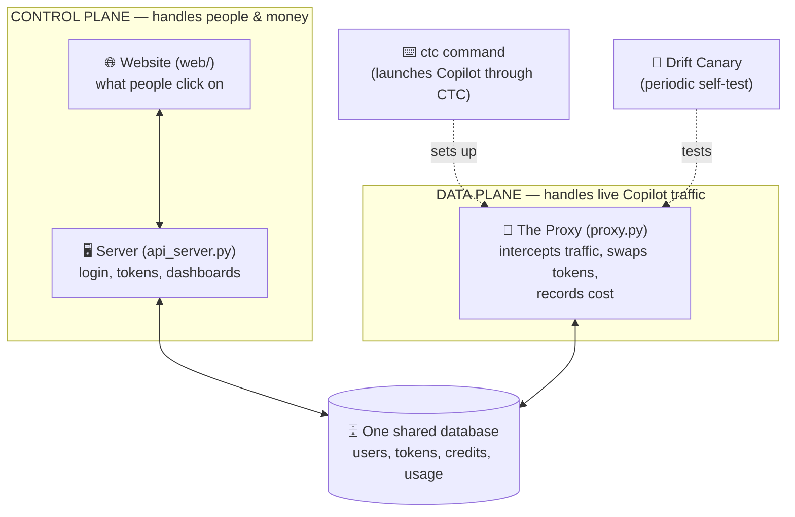
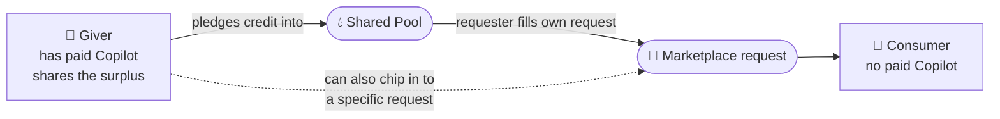
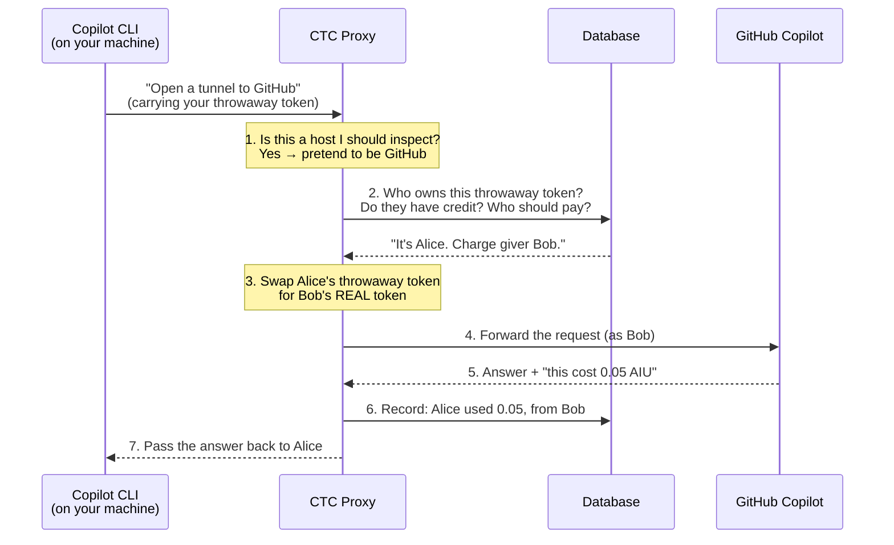

# 00 · Overview — the whole system

> **Layer 1** (this page) gives you the complete mental model. Each later page
> zooms into one piece. Unfamiliar word? See the [Glossary](glossary.md).

---

## Layer 1 — The big picture

CTC has **two halves** that share **one database**, plus a couple of helpers.

- The **data plane** is the busy part: every time someone uses Copilot, traffic
  flows through the Proxy.
- The **control plane** is the calm part: people log in, hand in their Copilot
  token, get a personal access code, and look at dashboards.
- They never talk to each other directly — they **coordinate through the shared
  database**. The Proxy writes "this person used X"; the website reads it back.

## Layer 1 — Two kinds of people

- A **giver** hands in their real Copilot token once. CTC reads how much capacity
  they have and lets them **pledge** part of it to a shared **pool**.
- A **consumer** has no token of their own. To get credit they post a request in
  the **marketplace**, then fill it from the shared pool themselves — or wait for
  a giver to chip in.
- Givers can also **chip in** to a specific teammate's request. All credit moves
  through the marketplace; nothing is routed automatically behind the scenes.

---

## Layer 2 — How a real request flows, step by step

This is the single most important thing to understand. Follow one Copilot
request from a consumer's keyboard to GitHub and back:

The magic is steps 2–3 and 6: CTC knows *who* is asking (from the throwaway
token), decides *who pays*, swaps in the real credentials so GitHub is happy, and
**writes down the exact cost** that GitHub reports.

### Why a "middleman" at all?

Copilot only talks to GitHub's servers, and it insists on a real, valid token. We
can't change Copilot. So instead we put a trusted middleman (the Proxy) on the
path: it lets people use *fake* tokens, and quietly substitutes a *real* one at
the last moment. Because the swap happens server-side, **no teammate ever holds
anyone else's real token.** Details: [01 · The Proxy](01-the-proxy.md).

---

## Layer 2 — The pieces, and where to read more

| Piece | One-line job | Deep dive |
|---|---|---|
| **Proxy** (`proxy.py`) | Intercept Copilot traffic, swap tokens, record cost. | [01](01-the-proxy.md) |
| **`ctc` CLI** (`cli/`) | One command to launch Copilot through CTC. | [02](02-the-cli-launcher.md) |
| **Identity / login** (`ctc/auth/`, `api_server.py`) | Log in with GitHub, sessions, the two token types. | [03](03-identity-and-login.md) |
| **Credits / accounting** (`ctc/accounting/`, `ctc/store/`) | Givers, consumers, pool, donations, the database. | [04](04-credits-and-accounting.md) |
| **Web app** (`web/`) | The dashboards people click on — leaderboard, marketplace, giver **tiers**, and public profiles. | [05](05-the-web-app.md) |
| **Drift detection** (`ctc/sentinel.py`, `ctc/canary.py`) | Warn if a Copilot update silently breaks billing. | [06](06-drift-detection.md) |

---

## Layer 3 — A few facts worth knowing up front

These save confusion later; each is explained fully in its own page.

- **One database, two writers.** Both the Proxy and the website read/write the
  same SQLite file (in "WAL" mode, which lets them do that safely). The Proxy is
  the only thing that *records usage*; the website only *reads and manages people*.
- **Money is stored in whole numbers.** Internally everything is **nano-AIU**
  (billionths of an AIU) so there's never a rounding error. The friendly "X.XX
  AIU" you see is computed only at the very last moment, in the browser.
- **The cost comes from GitHub, not a guess.** For every billable request,
  GitHub's own response includes a field, `copilot_usage.total_nano_aiu`, with
  the exact price. CTC reads that. (The whole drift-detection system exists to
  make sure that field never silently disappears — see [06](06-drift-detection.md).)
- **Enforcement happens *before* the request; billing happens *after*.** The
  Proxy checks "do you have credit?" before forwarding (and returns a `402` if
  not), then records the *actual* cost once GitHub replies.
- **The Proxy routes around dead givers.** Before charging a giver it checks a
  short-lived snapshot of that giver's live GitHub quota and skips any that are
  exhausted; if GitHub still rejects the chosen giver with a `402`, the Proxy
  marks them spent and **fails over** to another eligible giver instead of failing
  your request. See [04 · Credits & accounting](04-credits-and-accounting.md).
