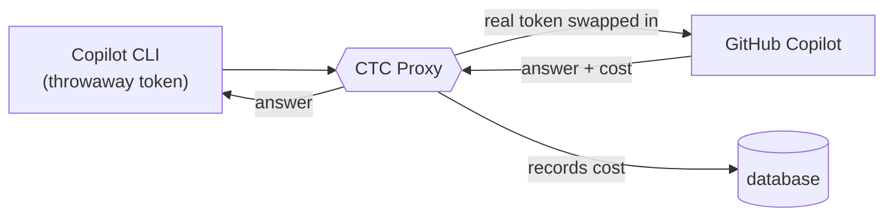
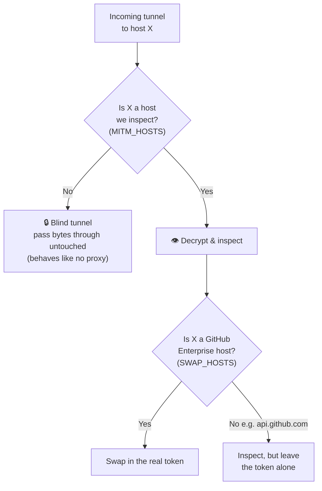
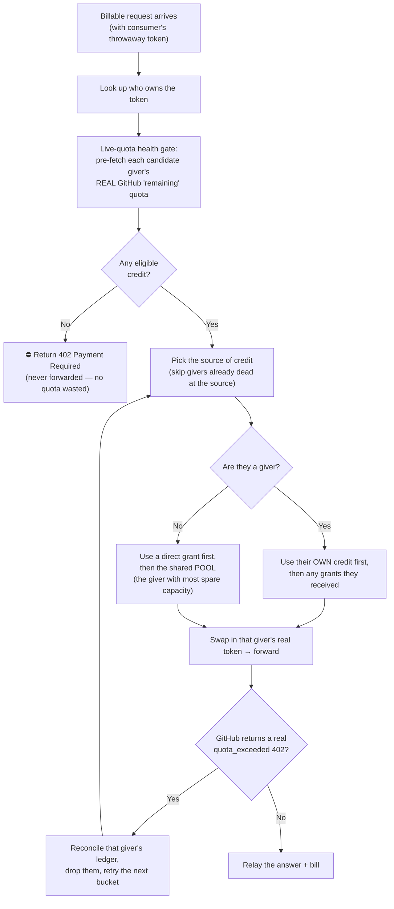
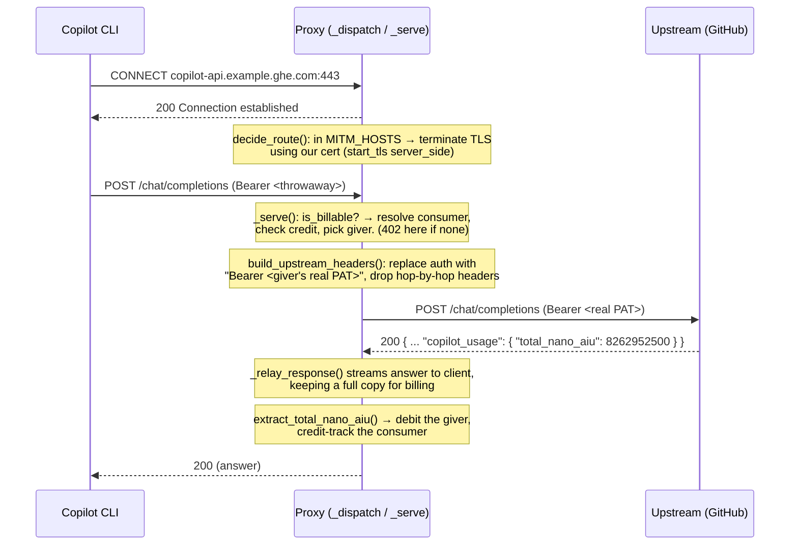

# 01 · The Proxy — interception, the token swap, rerouting

> The Proxy (`proxy.py`) is the heart of CTC. This page peels it in three layers.
> For the exhaustive, line-by-line reference (the "handshake" and the "don't
> touch" checklist), see [`TDD.md`](../../TDD.md) §11–12.

---

## Layer 1 — What it does, in plain words

The Proxy is a **trusted middleman** on the network. When you use Copilot through
CTC, all of Copilot's traffic goes to the Proxy instead of straight to GitHub.
The Proxy then:

1. **Recognises you** from your throwaway token.
2. **Checks you have credit.**
3. **Swaps** your throwaway token for a real giver's token.
4. **Forwards** the request to the real GitHub and passes the answer back.
5. **Records** exactly what it cost.

Because the swap happens inside the Proxy, **no teammate ever sees anyone else's
real credentials.** That's the whole point.



---

## Layer 2 — How it actually intercepts and reroutes

### Tricking Copilot into trusting the middleman

Normally you *can't* read someone's encrypted (HTTPS) traffic — that's the whole
point of HTTPS. CTC reads its *own* traffic on purpose, and it can only do that
because of two setup steps the user does once:

- **Install CTC's certificate.** This tells your computer "trust the Proxy as if
  it were GitHub." Now the Proxy can terminate the encrypted connection, read
  inside, and re-encrypt onward.
- **Point Copilot at the Proxy** (an environment variable, `HTTPS_PROXY`). The
  `ctc` command does this for you ([02](02-the-cli-launcher.md)).

There's also a **token-shape gate**: Copilot checks a token *looks* real before
it sends anything. So CTC's throwaway tokens are deliberately shaped like real
GitHub tokens (`github_pat_…`). If they weren't, Copilot would refuse to even try.

### Inspect some hosts, ignore the rest

The Proxy doesn't snoop on everything — that would break unrelated traffic. It
keeps **three lists** that drive every decision:



- **`MITM_HOSTS`** — the handful of hosts CTC decrypts and inspects. Everything
  else is "blind-tunnelled": bytes pass straight through, exactly as if CTC
  weren't there (so npm, OS updates, etc. keep working).
- **`SWAP_HOSTS`** — the subset that also gets the **real-token swap** (the GitHub
  Enterprise API hosts).
- **`_LOCALHOST_ALIASES`** — a quirk: some Copilot versions call `api.localhost`;
  the Proxy remaps that to the real GitHub host.

All three lists live in **one file**, `ctc/contract.py`, so there's a single
source of truth (this matters for drift detection — [06](06-drift-detection.md)).

### Who pays? Picking a giver per request

When a request *costs money*, the Proxy must decide whose real token to use:



Three rules that matter:

- **Check before, bill after.** Credit is checked *before* forwarding (so a
  broke user is stopped with a `402` and no GitHub call happens). The *actual*
  cost is recorded *after* GitHub replies — because the price is only known then.
- **Health gate + failover-on-402.** Before choosing a giver, the Proxy peeks each
  candidate's *real* GitHub `premium_interactions.remaining` (a small cached lookup)
  so it can skip a giver who's already exhausted upstream. And if a giver still
  comes back with a genuine GitHub `quota_exceeded` 402, the Proxy reconciles that
  giver's ledger, excludes them, and retries the request against the next bucket —
  so one drained giver doesn't surface as a failure to the user.
- **One giver per request.** A single request is fully charged to one giver; CTC
  never splits a request across givers.

---

## Layer 3 — Under the hood

### The connection, blow by blow



Key functions in `proxy.py`: `_dispatch` (first request, CONNECT, MITM-vs-tunnel),
`_serve` (the per-request loop), `build_upstream_headers` (the swap),
`_relay_response` (streams the answer while keeping a full copy for billing),
`_blind_tunnel` (the pass-through path).

### What "billable" means precisely

A request is metered only if **all three** are true (`is_billable`):

- host is `copilot-api.example.ghe.com`, **and**
- method is `POST`, **and**
- path is `/chat/completions`, `/v1/messages`, or `/responses`.

Everything else (the login/quota checks, model lists, telemetry) flows through
but is never charged.

### One token, swapped every time — no hand-back

A natural assumption is that Copilot logs in once, gets a fresh token back from
GitHub, and "continues with" that token. **That's not what happens here.**
Verified against the real captured traffic and an operator probe
(`tools/verify_token_rewrite.py`): GitHub does **not** hand Copilot a token to
switch to. Copilot keeps using its **one** token (the throwaway one) on *every*
call — the login calls and the actual AI calls alike — and the proxy swaps it
for the giver's real PAT on **every outbound request**. GitHub's Copilot API
accepts that swapped PAT directly.

### Why CTC never *fakes* the GitHub login calls

You might think CTC could just *pretend* to be GitHub for the login/quota calls
(`/copilot_internal/user`) instead of forwarding them. It deliberately doesn't —
but not because of any token it would hand back. The reason is simpler: Copilot
**reads those replies to decide it's allowed and how to proceed**. They're
instructions, not just credentials. Faking them means perfectly reproducing
GitHub's private, undocumented responses, and any wrong field makes Copilot
misbehave or give up. Forwarding (with the real PAT swapped in) lets GitHub
return correct answers for free, so CTC only ever has to swap one header.

### The authorization header must say `Bearer`

GitHub's Copilot API rejects `Authorization: token <pat>` with a `400`. It
requires `Authorization: Bearer <pat>`. The Proxy normalises this for the GitHub
Enterprise hosts unconditionally during the swap.

### What the wire actually looks like

**A billable request** (headers Copilot sends; the token is redacted — CTC never
logs it):

```
POST /chat/completions   (host: copilot-api.example.ghe.com)
authorization:          ***REDACTED***            ← this is what gets swapped
editor-version:         copilot/1.0.63
copilot-integration-id: copilot-developer-cli
x-github-api-version:   2026-06-01
user-agent:             copilot/1.0.63 (darwin ...) term/vscode

body: { "model": "...", "messages": [ ... ], "stream": false }
```

**The response that carries the cost** — for a plain JSON reply
(`/chat/completions`), the price is a top-level field:

```json
{
  "choices": [ ... ],
  "model": "gpt-4o-mini-2024-07-18",
  "copilot_usage": {
    "token_details": [ ... ],
    "total_nano_aiu": 0
  }
}
```

(Here `total_nano_aiu` is `0` — GitHub priced *this particular* request at zero.
**CTC doesn't classify any model as "free"** — it charges exactly the number
GitHub returns, per request. The same model can come back non-zero another time,
and an **agent run fires many metered requests** (planning + tool calls +
follow-ups), so even a cheap model adds up. A `0` is a valid price, not an error.)

For a **streamed** reply (`/v1/messages`, used by Claude models), the answer
arrives in many small pieces and the cost is in the **final** piece, a
`message_delta` event at the very end of the stream:

```
event: message_delta
data: { "copilot_usage": { "total_nano_aiu": 8262952500 }, "delta": { "stop_reason": "end_turn" }, ... }
```

`8262952500` nano-AIU = **8.26 AIU**. Because this number is at the *tail* of a
long stream (past the normal log limit), the Proxy keeps a **full copy** of the
response specifically so it can read the price for billing.

> **The single most load-bearing fact in all of CTC:** the price lives at
> `copilot_usage.total_nano_aiu`. If a future Copilot update moves or renames it,
> every charge would silently become `0`. That exact risk is why the
> [drift canary](06-drift-detection.md) exists.

### Safety details

- The real PAT is **never** logged and **never** sent back to the user.
- Database reads/writes for one request are sequenced so they never overlap with
  network waits (SQLite isn't safe to touch mid-await) — see the invariant note
  in `proxy.py`.
- A `402 Payment Required` is returned *before* any GitHub call when there's no
  eligible credit, so a broke user never wastes a giver's quota.
- **CTC's own blocks carry a readable message.** When the Proxy refuses a request
  before forwarding, it doesn't just send a bare status code — it renders the
  reason in the endpoint's *native* error shape (OpenAI-shaped for
  `/chat/completions` and `/responses`, Anthropic-shaped for `/v1/messages`) so the
  Copilot CLI surfaces it the same way it shows a real GHE quota error. The cases:
  `402` ("exceeded your monthly quota (CTC credit pool)"), `401` (unrecognized proxy
  token → run `ctc login`), and `503` (no active billing cycle → contact the
  operator). CTC's own 402 is tagged `code: "ctc"` so it's distinguishable from a
  real GitHub `quota_exceeded` 402.

**Next:** how a person gets set up to use all this → [02 · The `ctc` CLI](02-the-cli-launcher.md).
