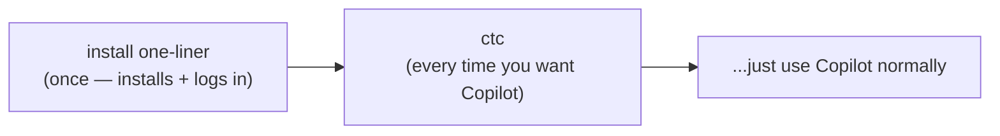
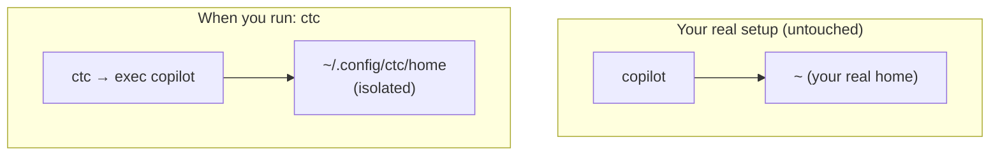

# 02 · The `ctc` command — the one-line launcher

> A small convenience tool (`cli/ctc`, a Bash script) so teammates don't have to
> configure environment variables and certificates by hand.

---

## Layer 1 — What it's for

To use Copilot through CTC, a few things must be set up on your machine: trust
CTC's certificate, point Copilot at the Proxy, and give Copilot your throwaway
token. Doing that by hand is fiddly and easy to get wrong.

The `ctc` command bundles it into **one setup line you run once**, then **one
command you run daily**:



The setup line comes from the website (Settings → "Set up CLI", or the first-run
walkthrough) with **your throwaway token already baked in**, so there's nothing to
paste:

```bash
curl -fsSL https://<ctc-host>/install.sh | sh -s -- --token <your-proxy-token>
```

That single command installs the `ctc` launcher **and** logs you in. (Prefer to do
it by hand? `ctc login` with no arguments still prompts you to paste the token —
see below.)

It also **keeps your CTC setup completely separate** from your personal Copilot.
Both can live on the same machine; running plain `copilot` still uses your own
account, untouched.

---

## Layer 2 — The commands

| Command | What it does |
|---|---|
| `ctc login` | Set up your machine: download + trust CTC's certificate and save your settings. Asks for your password once (to trust the cert). Pass `--token <t>` to supply the proxy token non-interactively (what the install one-liner uses); with no `--token`, it prompts you to paste it. |
| `ctc` | Launch Copilot through CTC. Any Copilot flags pass straight through (e.g. `ctc -p "explain this code"`). |
| `ctc status` | Show whether you're set up: the proxy host, the last 4 characters of your token, and whether the cert is trusted. Never prints the full token. |
| `ctc logout` | Remove your CTC settings. Your personal Copilot and GitHub config are left untouched. |
| `ctc --help` | Show usage. |

### How "kept separate" works

When you run `ctc`, it temporarily tells Copilot to use a **private home folder**
(`~/.config/ctc/home`) just for CTC. Copilot stores its CTC-specific settings
there, nowhere near your real ones. The moment you run plain `copilot` instead,
you're back to your normal, personal setup.



---

## Layer 3 — Under the hood

`ctc login` writes a settings file (`~/.config/ctc/env`, readable only by you)
that sets these environment variables whenever you run `ctc`:

| Variable | Why |
|---|---|
| `HTTPS_PROXY=http://<ctc-host>:8080` | Routes all of Copilot's traffic through the CTC Proxy. |
| `COPILOT_GITHUB_TOKEN=<your proxy token>` | The throwaway token that identifies you to CTC. |
| `GH_HOST=example.ghe.com` | Tells Copilot it's talking to the GitHub Enterprise host. |
| `HOME=~/.config/ctc/home` (+ XDG dirs) | The isolation trick — a private config home for CTC. |
| `NODE_EXTRA_CA_CERTS=~/.config/ctc/ca.pem` | Extra cert trust for Node-based tools. |

Then `ctc` simply **`exec`s the stock `copilot`** with those variables in place —
it never modifies Copilot itself.

### How the one-liner logs you in

`install.sh` accepts `--token <t>`: after it installs the `ctc` binary, if a token
was passed it runs `ctc login --token <t>` for you — so the single curl command both
installs and logs in. `ctc login --token <t>` just skips the interactive paste and
uses the supplied token; everything else (cert download, keychain trust, writing the
settings file) is identical to the prompted path. The token is your ordinary
**disposable proxy token** — revocable and rotatable in Settings — so it carrying
through your shell history is low-impact (it maps to a real PAT only *inside* the
proxy, and you can revoke it anytime).

### The certificate step (and why it needs `sudo` once)

`ctc login` downloads CTC's certificate and trusts it in the **macOS System
keychain** (`sudo security add-trusted-cert …`). This one-time password prompt is
necessary because Copilot ships its *own* copy of the Node runtime that ignores
the usual per-app cert settings — only OS-level trust convinces it. (`ctc logout`
tells you the command to remove the cert if you ever want to.)

### Platform note

The launcher is **macOS-only** for now, because the automatic certificate-trust
step uses the macOS `security` tool. On Linux/Windows you can do the same setup
by hand — see [`TDD.md`](../../TDD.md) §6.3.

> ### ⚠️ TODO — Windows / cross-platform launcher
> The mechanism is OS-agnostic (set env vars → trust the CA cert → run
> `copilot`), but `cli/ctc` is a Bash script and only automates the **macOS**
> cert trust. A **Windows launcher** (e.g. a PowerShell `ctc.ps1`) needs to do
> the same three steps the Windows way — env + isolated home under `%APPDATA%`,
> trust the cert via `Import-Certificate` into the machine Root store (admin),
> then run `copilot` — and confirm Copilot honours `HTTPS_PROXY` + the trusted
> cert there. Until then, Windows/Linux users use the manual setup in
> [`TDD.md`](../../TDD.md) §6.3. (May be subsumed by the planned CLI rework.)

**Next:** how logging in and the two kinds of tokens work →
[03 · Identity & login](03-identity-and-login.md).
