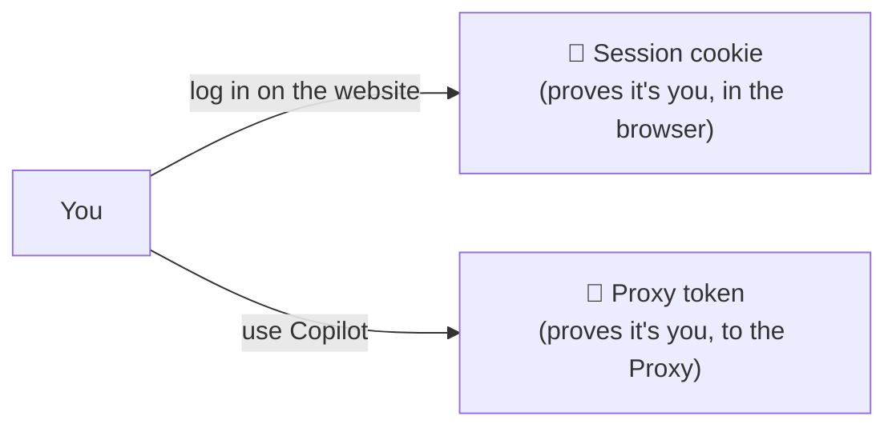
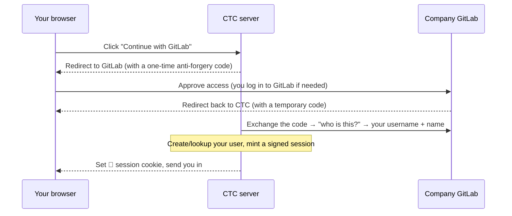
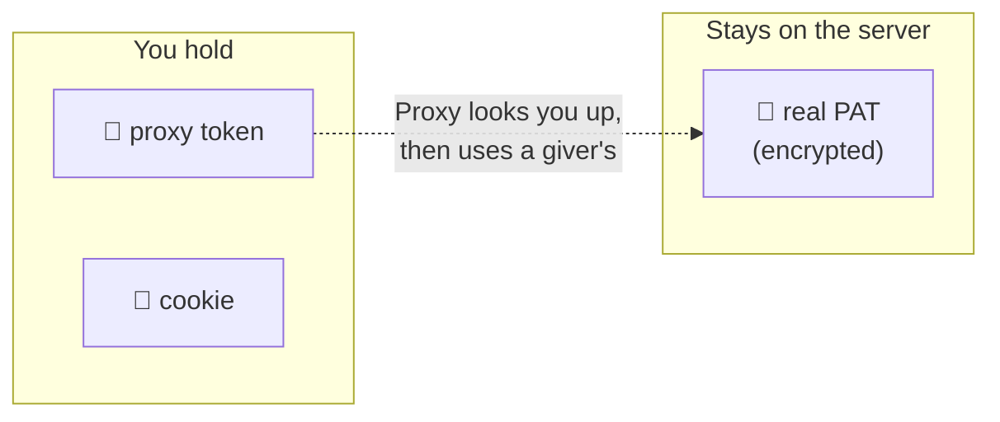

# 03 · Identity & login — who you are, and the two tokens

> How people log in, how the server remembers them, and the **two completely
> different kinds of token** that often cause confusion.
> Code lives in `ctc/auth/` and `api_server.py`.

---

## Layer 1 — The idea

CTC uses **GitLab OAuth** as its sole login path. You log in with your existing
company GitLab account. Your identity is your GitLab username.

After login, the website remembers you with a small signed cookie. Two things can
identify you in CTC, and they're easy to mix up:

- The **session cookie** is for the *website*.
- The **proxy token** is for *Copilot traffic*.

And separately, if you're a giver, there's your **real GitHub token** — the
valuable secret CTC guards.

---

## Layer 2 — Logging in

### GitLab OAuth

"OAuth" just means: CTC sends you to GitLab to prove who you are, and GitLab
sends you back with a stamp of approval. CTC never sees your GitLab password.

**Requires** `GITLAB_BASE`, `GITLAB_OAUTH_CLIENT_ID`, `GITLAB_OAUTH_CLIENT_SECRET`,
`GITLAB_OAUTH_REDIRECT_URI`, and a GitLab OAuth application registered with the
correct callback URL (see the deployment guide for registration steps).

**Identity:** your identity is your GitLab username. `CTC_ADMINS` must list GitLab
usernames (the `ghe_login` field stores the GitLab username).

### After login

From then on, your browser sends that cookie with every request, and the server
knows it's you. The cookie is **signed** (so it can't be forged) and **expires**
after 24 hours. Logging out deletes it immediately.

**First time in?** New users haven't been through setup yet (the server tracks an
`onboarded` flag), so they're shown the skippable [first-run walkthrough](05-the-web-app.md)
before the dashboard. Returning users skip straight to the dashboard.

### Becoming a giver: handing in your Copilot token

A consumer becomes a giver by submitting their real Copilot **PAT** — either during
the first-run walkthrough or later on the Settings page (same call either way). CTC
then:

1. **Checks it's really yours** — it calls GitHub Enterprise with the PAT and confirms the
   GHE login matches the account you're logged in as. (You can't register
   someone else's token.)
2. **Reads your capacity** — how much Copilot quota that PAT has.
3. **Stores it encrypted** and flips your role to **giver**.

---

## Layer 2 — The two (well, three) tokens, side by side

This table is the thing to remember:

| | 🔑 Giver's real PAT | 🎫 Proxy token | 🍪 Session cookie |
|---|---|---|---|
| **What it is** | The giver's actual paid-Copilot secret | A throwaway code CTC gives you | A signed "you're logged in" marker |
| **Used for** | Talking to real GitHub (the Proxy uses it) | Identifying you in Copilot traffic | Using the website |
| **Where it lives** | **Encrypted** in CTC's database, never leaves the server | You paste it into Copilot (`COPILOT_GITHUB_TOKEN`) | Your browser |
| **How many** | One per giver | As many as you want; each revocable | One per login (24h) |
| **If leaked** | Bad — but it's encrypted at rest and never logged | Low impact — revoke it, it's useless to GitHub anyway | Expires in 24h; log out to kill it |

The crucial design win: the thing you hold (the proxy token) is **not** the
valuable thing (the real PAT). The Proxy connects the two *internally*, so
sharing access never means sharing secrets.

---

## Layer 3 — Under the hood

### Sessions
A session cookie is `<random-id>.<signature>`. The signature is an HMAC using the
server's secret key (`CTC_SECRET_KEY`), checked in constant time on every
request. The server keeps a `sessions` table (id, user, expiry). Logout deletes
the row.

### Proxy tokens
Minted as `github_pat_` + 60 random characters (so Copilot accepts the shape).
Only a **SHA-256 hash** of the token is stored — the raw value is shown to you
**once**, never again. When the Proxy sees a token, it hashes it and looks up the
hash. Revoking sets a `revoked_at` timestamp, and revoked tokens stop resolving
instantly. Listing your tokens shows only the last 4 characters.

### Real PATs at rest
Encrypted with **AES-256-GCM** (a strong, tamper-evident scheme). The encryption
key is derived from `CTC_SECRET_KEY`, which lives only in the server's
environment — never in the database, never in git. Each PAT is encrypted with a
fresh random nonce, so even identical PATs produce different ciphertext. The PAT
is decrypted only for the instant the Proxy needs to forward a request.

### The relevant files
- `ctc/auth/oauth.py` — the GitLab OAuth dance.
- `ctc/auth/sessions.py` — signed-cookie sessions.
- `ctc/auth/registry.py` — minting/looking up proxy tokens, storing PATs.
- `ctc/auth/crypto.py` — the AES-GCM encryption.
- `ctc/auth/onboarding.py` — validating a submitted PAT and promoting to giver.
- `api_server.py` — the HTTP endpoints that tie it together (`/auth/login`,
  `/auth/callback`, `/auth/logout`, `/api/me`, `/api/pat`, `/api/proxy-token`,
  `/api/onboarding/complete`).

**Next:** what "credit" actually means and how it's tracked →
[04 · Credits & accounting](04-credits-and-accounting.md).
