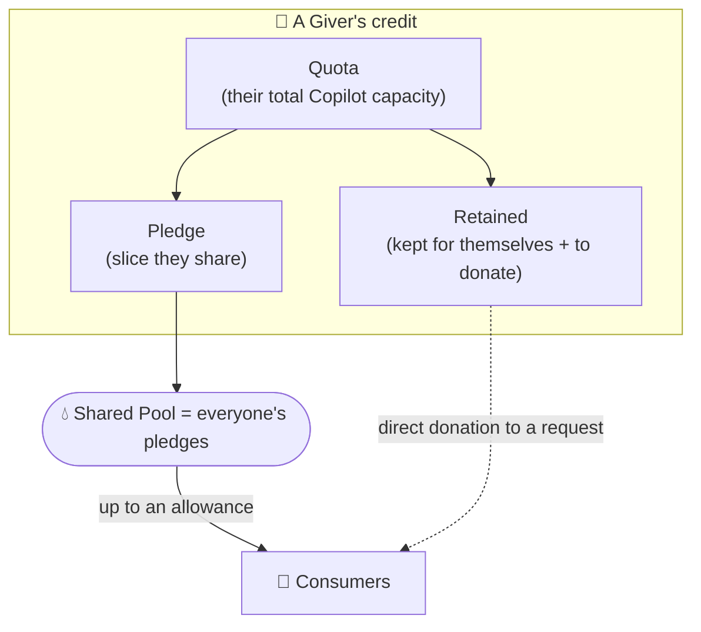
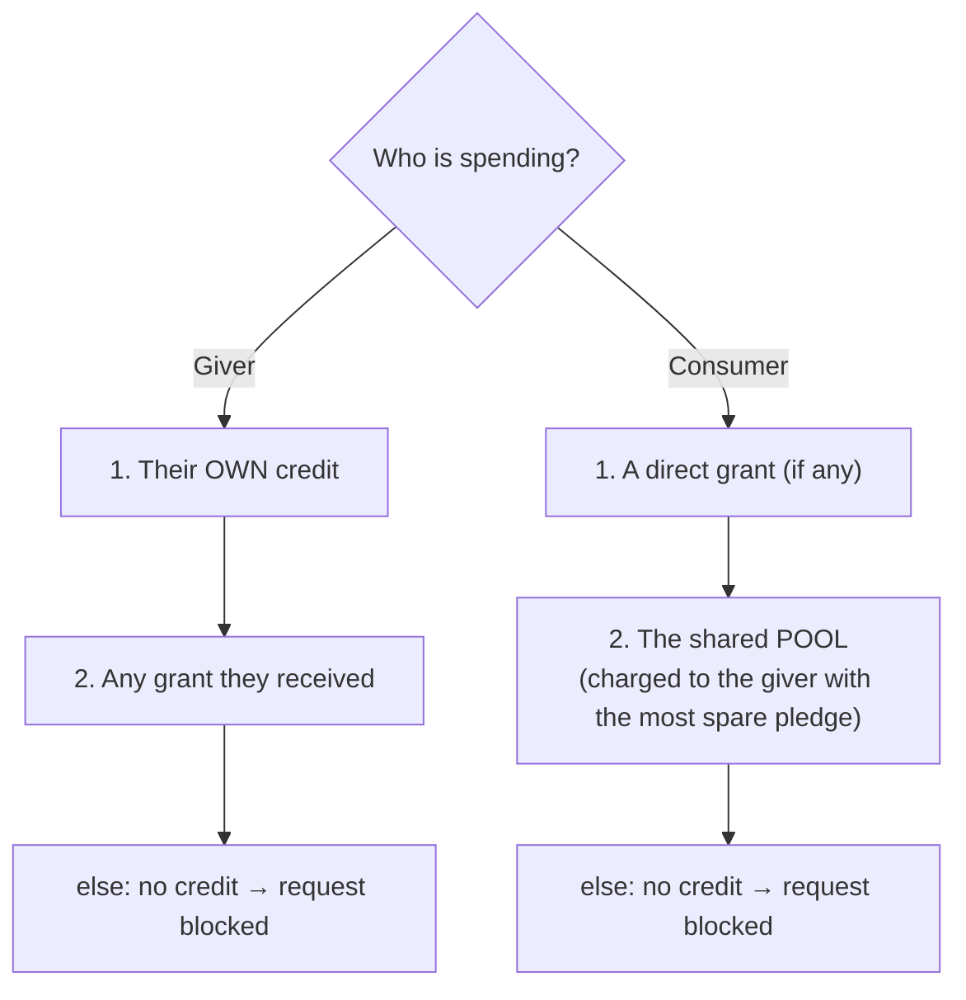

# 04 · Credits & accounting — the fair-sharing rules

> How CTC measures usage, who can spend what, and how it's all stored. This is
> the "money" model. Code lives in `ctc/accounting/`, `ctc/domain/`, `ctc/store/`.

---

## Layer 1 — The unit: AIU

GitHub prices Copilot in **AIU** ("AI Units"). A small request costs a tiny
fraction of one AIU; a big one with lots of context costs a few.

CTC counts usage in AIU. Internally it stores everything in **nano-AIU**
(billionths of an AIU) using whole numbers — this avoids rounding mistakes. You
never see nano-AIU; the website always shows friendly "**12.34 AIU**".

> **1 credit = 1 nano-AIU.** Stored as whole numbers everywhere; converted to
> "X.XX AIU" only at the last moment, in the browser.

---

## Layer 1 — Who can spend what

- A **giver** has a **quota** (read from GitHub when they hand in their token).
- They choose a **pledge**: how much of that quota to drop into the shared
  **pool**. The rest is **retained** — for their own Copilot use, or to donate
  directly.
- **Consumers** draw from the pool, but only up to a per-person **allowance**
  (default **300 AIU** per cycle) so no one can drain it.
- A giver can also **directly donate** retained credit to a specific teammate's
  request in the marketplace (a "grant").

Everything resets each **cycle** (a billing period, e.g. a month).

---

## Layer 2 — The rules, precisely (but in plain words)

### What a giver has left for themselves

> **Retained = Quota − Pledge − (what they've used themselves) − (what they've donated)**

In code this is `personal_remaining`. It's the credit a giver can still spend on
their own Copilot use *or* donate to a request.

### What's left in the pool

Each giver's pledge minus what consumers have already drawn from it. Add those up
across all givers → the **pool available** to consumers right now.

### The order credit is spent in

When someone makes a billable request, CTC picks where to draw from:

- A consumer using the pool is charged against **one specific giver** — whichever
  has the most spare pledged capacity at that moment.
- "Blocked" means the Proxy returns `402 Payment Required` *before* contacting
  GitHub (see [01](01-the-proxy.md)).

### The marketplace (requests & donations)

Anyone can post a **request** ("I need ~90 AIU to finish a PR"). Givers can
**fund** it from their retained credit, creating a **grant**. A request's status
is always one of:

| Status | Meaning |
|---|---|
| **open** | Posted, nothing funded yet. |
| **partially_funded** | Some credit donated, not enough yet. |
| **fulfilled** | Fully funded. |
| **expired** | The 24-hour window passed without being fully funded. |

(The status is never stored — it's recalculated from the donations and the clock
whenever it's shown.)

---

## Layer 3 — Under the hood

### Event-sourced, not "balances"

CTC doesn't keep a single "balance" number it edits. Instead it records every
**consumption event** ("Alice used 0.05 AIU from Bob's pledge at time T"). Any
balance you see is *computed* by adding up the relevant events. This makes the
accounting auditable and hard to corrupt.

### The database (one shared SQLite file)

Both the Proxy and the website use the same SQLite database (in "WAL" mode, which
lets two programs read/write safely). The tables:

**People & tokens** (managed by the control plane):

| Table | Holds |
|---|---|
| `users` | id, github login, display name, role (giver/consumer) |
| `sessions` | active website logins (id, user, expiry) |
| `proxy_tokens` | id, **hash** of the token, user, last-4 fingerprint, revoked-at |
| `giver_pats` | the giver's **encrypted** real PAT (ciphertext + nonce) |

**Credit & usage** (the accounting core):

| Table | Holds |
|---|---|
| `cycles` | billing periods (id, label, start, end, status) |
| `giver_cycles` | per giver per cycle: their `quota` and `pledge` |
| `requests` | marketplace asks (amount needed, reason, target, expiry) |
| `grants` | donations (donor, recipient, amount) |
| `consumption_events` | every spend: who, from which giver, which bucket (own/pool/grant), how many credits |

### Enforcement is atomic

When credit is checked-and-charged, CTC uses a database transaction
(`BEGIN IMMEDIATE`) so two requests can't both spend the last of the same credit.
Caps (pledge can't exceed quota, a consumer can't exceed their allowance) are
enforced inside that transaction.

### Where the numbers come from
- A giver's **quota** is read from GitHub's `/copilot_internal/user` response when
  they submit their PAT (the `premium_interactions.entitlement` field).
- A consumption event's **cost** is the `copilot_usage.total_nano_aiu` the Proxy
  read from GitHub's reply ([01](01-the-proxy.md)).
- The default consumer **allowance** is 300 AIU, configurable via
  `CTC_FREE_ALLOWANCE_AIU`.

### Relevant files
`ctc/accounting/engine.py` (the rules + atomic spend), `ctc/domain/rules.py`
(status, bucket order), `ctc/domain/config.py` (units, allowance),
`ctc/store/db.py` (schema), `ctc/store/accounting_store.py` (queries),
`ctc/accounting/leaderboard.py` + `reports.py` (dashboard/leaderboard/history
aggregations).

**Next:** the website people actually click on →
[05 · The web app](05-the-web-app.md).
