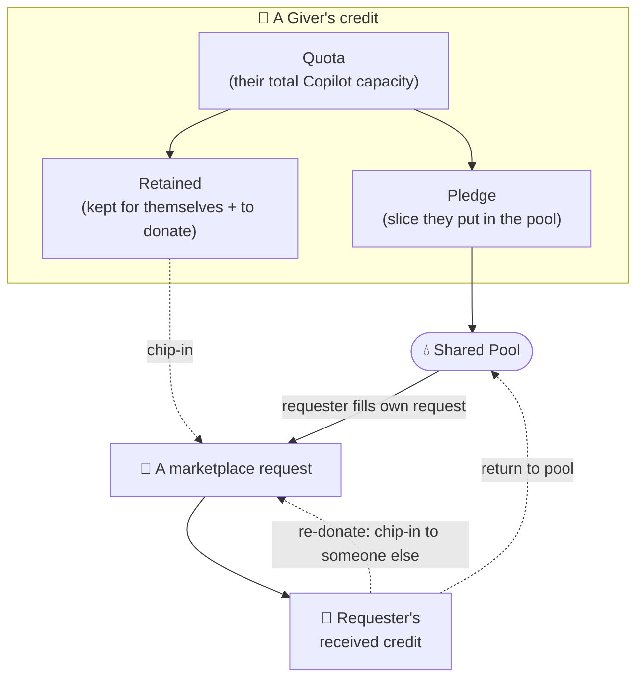
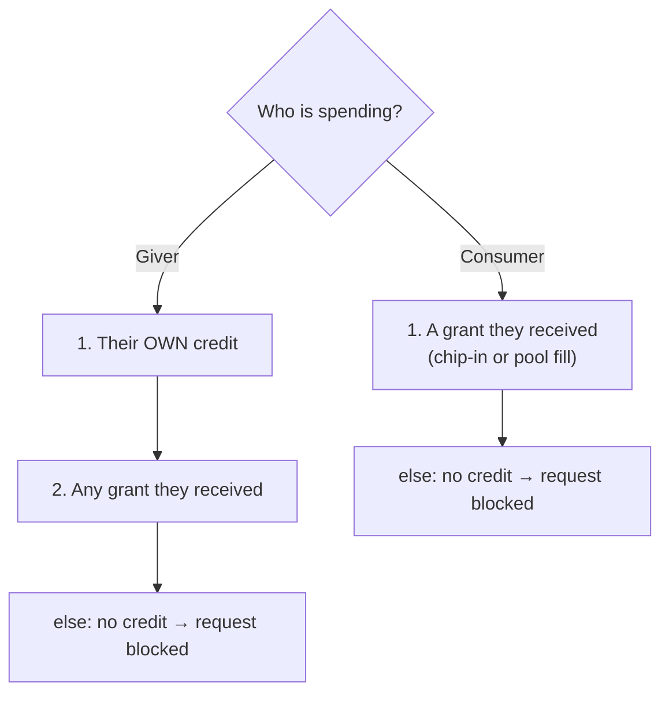

# 04 · Credits & accounting — the fair-sharing rules

> How CTC measures usage, who can spend what, and how it's all stored. This is
> the "money" model. Code lives in `ctc/accounting/`, `ctc/domain/`, `ctc/store/`.

---

## Layer 1 — The unit: AIU

GitHub prices Copilot in **AIU** ("AI Units"). A small request costs a tiny
fraction of one AIU; a big one with lots of context costs a few.

CTC counts usage in AIU. Internally it stores everything in **nano-AIU**
(billionths of an AIU) using whole numbers — this avoids rounding mistakes. You
never see nano-AIU; the website always shows friendly "**12.34 AIU**".

> **1 credit = 1 nano-AIU.** Stored as whole numbers everywhere; converted to
> "X.XX AIU" only at the last moment, in the browser.

---

## Layer 1 — Who can spend what

- A **giver** has a **quota** (read from GitHub when they hand in their token).
- They choose a **pledge**: how much of that quota to drop into the shared
  **pool**. The rest is **retained** — for their own Copilot use, or to donate
  directly.
- Credit only ever reaches someone **through the marketplace** — there is no
  automatic background routing. To get credit you post a **request**, then it's
  covered one of two ways:
  - a **giver chips in** from their retained credit (a "grant"), or
  - **you fill your own request from the pool** — only the requester can top up
    their *own* request from the shared pool, first-come-first-served, no
    per-person cap. The amount you drew shows on the request.
- A pool fill is attributed to a real giver (the origin donor of a returned
  contribution, or the giver with the most spare pledge), so the credit is always
  served by a concrete giver's token — it just isn't a personal gift from them.
- **Credit routed to you isn't a dead end.** Credit others put on your requests
  (or that you pulled from the pool) that you haven't burned yet, you can either:
  - **re-donate** it — chip in to *someone else's* request from your received
    credit, or
  - **return** it to the shared pool for anyone to fill a request with.
  Either way it keeps flowing to whoever needs it. To keep the books simple this
  is **one hop only**: credit that itself arrived via a re-donation or a pool
  draw can't be passed on again.

Everything resets each **cycle** (a billing period, e.g. a month).

---

## Layer 2 — The rules, precisely (but in plain words)

### What a giver has left for themselves

> **Retained = Quota − Pledge − (what they've used themselves) − (what they've donated)**

In code this is `personal_remaining`. It's the credit a giver can still spend on
their own Copilot use *or* donate to a request.

### What's left in the pool

The pool has two sources:
- **Pledges** — each giver's pledge minus what's already been drawn from it (by
  legacy auto-routing from earlier cycles and by marketplace pool fills).
- **Returned contributions** — credit that was routed to someone and they pushed
  back into the pool (charged to the original giver, so it's still served by a
  real token).

Add those up → the **pool available** for filling requests right now, shown on
the marketplace. When a request is filled, **returned contributions drain first**
(oldest-first) before anyone's pledge is touched, so recycled credit moves on
before fresh pledges are spent.

### The order credit is spent in

When someone makes a billable request, CTC picks where to draw from. Credit only
comes from grants now — the pool reaches people by *funding a request* (which
creates grants), never by auto-routing at spend time:

- Every grant — whether a personal chip-in or a pool fill — is served by **one
  specific giver's token**. A pool fill just picks the giver(s) with the most
  spare pledge automatically.
- "Blocked" means the Proxy returns `402 Payment Required` *before* contacting
  GitHub (see [01](01-the-proxy.md)).

### The marketplace (requests, chip-ins & pool fills)

Anyone can post a **request** ("I need ~90 AIU to finish a PR"). It gets covered
by creating **grants**, from any of these sources:

- **Chip-in (retained)** — another giver funds it from their own retained credit.
- **Chip-in (received / re-donate)** — someone funds it from credit that was
  routed to *them* and they haven't burned. The grant still forwards the original
  donor's token; the re-donor is recorded as the human "supporter" on the card.
- **Pool fill** — the **requester** tops up their *own* request from the shared
  pool (only the owner can do this; you can't pool-fill someone else's request).

When you chip in and you hold **both** kinds of credit (your own retained *and*
some routed to you), the marketplace asks which to spend. Otherwise it uses
whichever you have.

The owner can also **delete** their request; it soft-cancels (kept for history,
hidden from the board) and any unspent grant credit returns to its donor or the
pool. A request's status is always one of:

| Status | Meaning |
|---|---|
| **open** | Posted, nothing funded yet. |
| **partially_funded** | Some credit committed, not enough yet. |
| **fulfilled** | Fully funded. |
| **expired** | The 24-hour window passed without being fully funded. |
| **cancelled** | The owner deleted it. |

(The status is never stored — it's recalculated from the funding, the clock, and
the cancel flag whenever it's shown.)

### Aristocracy tiers (giver standings)

Givers get a playful **tier** based on their *net* contribution this cycle —
`net = (credit others burned from your gifts) − (credit you drew from other
givers)`. Your own quota usage doesn't count either way. Givers with net ≥ 0 and
some activity split into the top four bands by quartile; net < 0 splits into the
bottom two; no activity at all is **newcomer**:

| Tier | Meaning |
|---|---|
| 👑 Aristocrat / 🎩 Baron / 💰 Bourgeois / 🧍 Commoner | net ≥ 0, best → least (by quartile) |
| 🌾 Peasant / 🪦 Beggar | net < 0, least → most negative |
| 🥚 Newcomer | no give-or-take activity yet |

It's a leaderboard flourish, not a spending rule — tiers never gate credit.
(`ctc/accounting/tiers.py`, mirrored for display in `web/src/domain/tiers.ts`.)

---

## Layer 3 — Under the hood

### Event-sourced, not "balances"

CTC doesn't keep a single "balance" number it edits. Instead it records every
**consumption event** ("Alice used 0.05 AIU from Bob's pledge at time T"). Any
balance you see is *computed* by adding up the relevant events. This makes the
accounting auditable and hard to corrupt.

### The database (one shared SQLite file)

Both the Proxy and the website use the same SQLite database (in "WAL" mode, which
lets two programs read/write safely). The tables:

**People & tokens** (managed by the control plane):

| Table | Holds |
|---|---|
| `users` | id, github login, display name, role (giver/consumer) |
| `sessions` | active website logins (id, user, expiry) |
| `proxy_tokens` | id, **hash** of the token, user, last-4 fingerprint, revoked-at |
| `giver_pats` | the giver's **encrypted** real PAT (ciphertext + nonce) |

**Credit & usage** (the accounting core):

| Table | Holds |
|---|---|
| `cycles` | billing periods (id, label, start, end, status: `active`/`archived`) |
| `cycle_reports` | frozen snapshot (JSON) of each archived cycle's history report |
| `giver_cycles` | per giver per cycle: their `quota` and `pledge` |
| `requests` | marketplace asks (amount needed, reason, target, expiry, cancelled-at) |
| `grants` | funding (donor, recipient, amount, source: `personal`/`pool`; plus the re-donation chain: `origin_grant_id`, `via_user_id`, `contribution_id`) |
| `pool_contributions` | credit a recipient returned to the pool (contributor, origin grant, original donor, amount) |
| `consumption_events` | every spend: who, from which giver, which bucket (own/pool/grant), how many credits |

The re-donation chain columns on `grants` keep the books honest: a re-donated or
pool-drawn grant sets `origin_grant_id` to the parent grant it was funded from
(so `donor_id` stays the original token holder for routing), `via_user_id` to the
human who passed it on, and `contribution_id` when it was drawn from a returned
pool contribution. Re-donation depth is capped at 1 — a grant with an
`origin_grant_id` can't itself be re-donated or returned.

### Enforcement is atomic

When credit is checked-and-charged, CTC uses a database transaction
(`BEGIN IMMEDIATE`) so two requests can't both spend the last of the same credit.
Caps (pledge can't exceed quota, a pool fill can't exceed the pool's remaining
balance or the request's remaining need) are enforced inside that transaction.

### Spending a grant spills across grants

A consumer might hold several grants at once (chip-ins and pool fills alike).
When the actual cost of a request turns out larger than the grant CTC picked, the
charge **spills**: it drains the selected grant first, then the consumer's other
active grants in order, each clamped to what's left in it, before any leftover
lands (with overshoot allowed, since the spend already happened upstream) on the
original source. "Own" spends don't spill — their overshoot is absorbed by that
single bucket. This keeps a debit from over-draining one grant while the consumer
still has others.
(`ctc/routing/attribution.py` `debit()`, `ctc/accounting/engine.py`.)

### Cycles roll over automatically

There's no scheduler. The moment any live-cycle lookup happens *after* the active
cycle's end date (a request through the Proxy, or a page load), CTC **rolls over**
in one atomic step: it archives the ended cycle, opens the cycle for the current
calendar month, and **seeds** the new cycle's givers from their connected PATs
(quota = the PAT's entitlement, since GitHub resets the real quota at the boundary
too; each giver's prior pledge is carried forward and clamped to the new quota).
Multiple dormant months jump straight to the current month — no empty
in-between cycles. (`ctc/accounting/engine.py` `ensure_active_cycle` / `_roll_over`.)

### Archived reports are frozen

A past cycle's history report (winners, top donors, totals) is computed **once**,
the first time it's viewed after archival, then stored in `cycle_reports` and
served from that snapshot forever after. This stops a past report's *labels*
(names, who-was-a-giver) from drifting when people are renamed or re-roled in a
later month. The **active** cycle is always recomputed live. Credit totals were
always stable (they derive from frozen events); freezing fixes only the labels.
(`ctc/accounting/reports.py` `build_history`.)

### Where the numbers come from
- A giver's **quota** for the cycle is the credit they have *left*, read from
  GitHub's `/copilot_internal/user` response when they submit their PAT (the
  `premium_interactions.remaining` field). The `entitlement` (monthly maximum) is
  stored too, for display. If GitHub omits `remaining`, CTC seeds the quota at
  **0** (assume spent), not at the full entitlement — a later live read corrects
  it upward. (`ctc/auth/onboarding.py`.)
- A consumption event's **cost** is the `copilot_usage.total_nano_aiu` the Proxy
  read from GitHub's reply ([01](01-the-proxy.md)), charged on every billable
  endpoint (`/chat/completions`, `/v1/messages`, `/responses`).
- Whether the shared pool is available at all is the `CTC_SHARED_POOL` toggle
  (admin-controllable); there is no per-person spending cap on it.

### Relevant files
`ctc/accounting/engine.py` (the rules + atomic spend + pool fill + cancel + cycle
rollover), `ctc/routing/attribution.py` (source selection + grant-spill debit),
`ctc/domain/rules.py` (status, bucket order), `ctc/domain/config.py` (units),
`ctc/auth/onboarding.py` (PAT validation + quota seeding),
`ctc/store/db.py` (schema), `ctc/store/accounting_store.py` (queries),
`ctc/accounting/tiers.py` (aristocracy tiers), `ctc/accounting/leaderboard.py` +
`reports.py` (dashboard/leaderboard/history aggregations + report freezing).

**Next:** the website people actually click on →
[05 · The web app](05-the-web-app.md).
