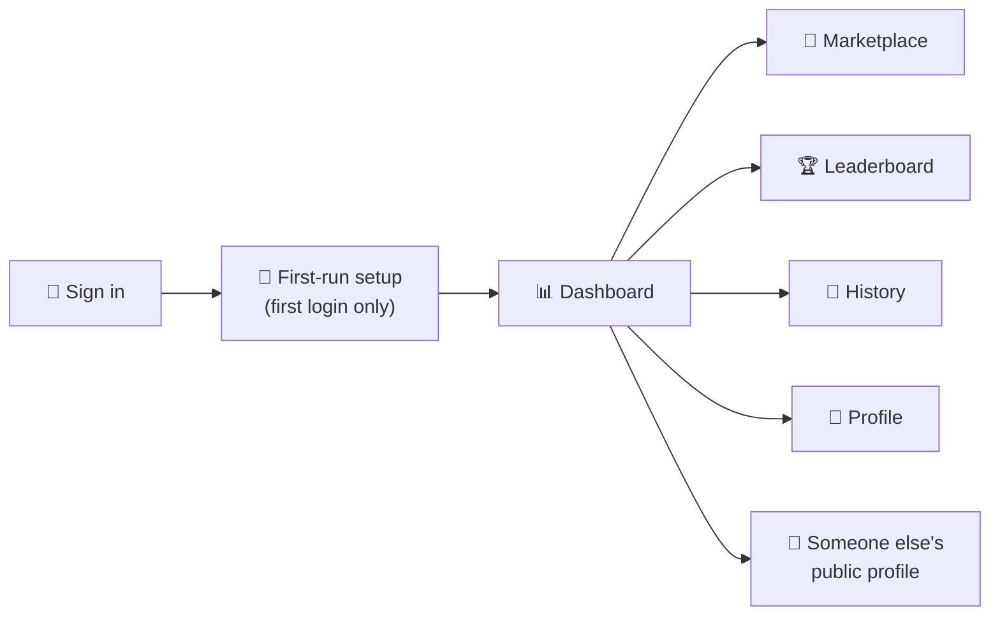
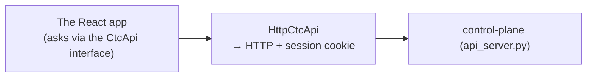

# 05 · The web app — the dashboards people click on

> The website (in `web/`) is what teammates actually see. It's a React app; it
> doesn't hold any logic of its own about credit — it just shows what the server
> tells it and sends actions back.

---

## Layer 1 — The screens

| Screen | What you see |
|---|---|
| **Sign in** | A single **"Continue with GitLab"** button — GitLab OAuth is the only way in, and your account is created on first login (the [login flow](03-identity-and-login.md)). There is no email/password or magic-link form. |
| **First-run setup** | A short, **skippable** walkthrough shown once after your first login: pick a role (giver/consumer), givers validate their PAT + set a pledge, and everyone gets the ready-to-run CLI install one-liner. It only does what your Profile already does — just guided. Skip anytime; it never reappears. |
| **Dashboard** | Your credit summary, a recent-activity feed (each row timestamped `HH:MM` with the amount in AIU), and a snapshot of the marketplace. |
| **Marketplace** | Open credit requests you can chip in to, a live **shared-pool balance**, and a form to post your own. On your own requests you get **From pool** (top it up from the shared pool) and **Delete** (soft-cancel); expired requests fade out. |
| **Leaderboard** | Top givers and top consumers this cycle. |
| **History** | Past cycles: how much was consumed and donated. |
| **Profile** | Your own detailed stats: quota, pledge, retained, donated, consumed, plus a **"Routed to you"** panel showing credit others chipped in / you pulled from the pool onto your requests (used vs left, and how much came from the pool). This is also where you **hand in your Copilot token** (become a giver), set your pledge, and get your **CLI setup** code (proxy token + install command) — the old separate "Settings" screen is gone and `/app/settings` now redirects here. Givers also get **Rotate** (replace the stored PAT) and **Revoke** (remove it and zero this cycle's credit) buttons. |
| **Public profile** | A read-only view of *another* teammate's stats (`/app/users/:id`): their name, role, aristocracy **tier badge**, and — for givers — net/donated this cycle. Reached by clicking any user's name in the marketplace, dashboard, leaderboard, or via the header **people search**. |

A couple of things appear on **every** signed-in screen:

- **People search** — a "Search people…" box in the top bar (`HeaderSearch`) that looks
  users up as you type and jumps to their public profile.
- **Tier badges** — a playful "aristocracy" rank (Aristocrat 👑, Baron 🎩, Bourgeois 💰,
  Commoner 🧍, Peasant 🌾, Beggar 🪦, Newcomer 🥚) shown next to users, derived purely from
  display data in `web/src/domain/tiers.ts`.
- **Admin** — admins see an extra **Admin** screen for the deployment-wide settings
  (default pledge, request-expiry, credit↔euro rate, default chip-in, participants/pool
  toggles); numeric fields use a shared `NumberInput` component.

> Note on labels: in the UI a giver is shown as **"Host"** and a consumer as **"Guest"**;
> the underlying role values are still `giver`/`consumer`.

---

## Layer 2 — How the website talks to the server

The app is built around **one interface** (`CtcApi`) that lists every action it
can take — "log in", "get dashboard", "donate", and so on. Each action is a real
HTTP call to the control-plane server, carrying your session cookie:

The website holds no credit logic of its own — it shows what the server returns
and sends actions back. Everything you see (dashboard, marketplace, leaderboard,
profile, settings) comes from the server.

---

## Layer 2 — One important unit rule

The server speaks **nano-AIU** on the wire (big whole numbers). The browser is
the only place that converts to human "X.XX AIU":

- A helper called `aiu()` divides by a billion and adds " AIU" for display.
- When you type a number in (e.g. a pledge), the app multiplies it back up before
  sending.

So if you ever see "0.00 AIU" where you expected a real number, it's almost
always a units bug (someone converted twice, or not at all). The rule is simple:
**nano everywhere except the very edge of the screen.**

---

## Layer 3 — Under the hood

- **Framework:** React + Vite + TypeScript, under `web/`.
- **The seam:** `web/src/api/CtcApi.ts` is the interface and `HttpCtcApi.ts` is
  its HTTP implementation; `web/src/store/AppContext.tsx` wires it into the app.
- **Auth:** every call uses `credentials: 'include'` so the httpOnly session
  cookie rides along; the server identifies you from that cookie. Logging in is a
  full-page redirect into **GitLab OAuth** (not an in-page form), because that's how
  OAuth works — there is no email/magic-link path.
- **Units:** `web/src/domain/credit.ts` holds `aiu()` (display) and
  `NANO_PER_AIU`; inputs multiply by it before sending.
- **The screens** live under `web/src/screens/` (one folder each:
  `Auth`, `Onboarding`, `Dashboard`, `Marketplace`, `Leaderboard`, `History`,
  `Profile`, `PublicProfile`, `Admin`, plus the public `Landing`). Settings was
  folded into `Profile`.
- **Shared widgets** live under `web/src/components/` — notably `HeaderSearch`
  (people search), `UserLink` (makes any name clickable through to a public
  profile), `TierBadge` (the aristocracy rank), and `NumberInput`.
- **The first-run gate:** the server tracks an `onboarded` flag per user (exposed
  on `/api/me`). Until it's set, the route guard sends you to the walkthrough;
  finishing or skipping calls `POST /api/onboarding/complete`, which flips the flag
  so you go straight to the dashboard on every later login.

> The first time you log in you're shown the skippable first-run setup; after that
> you land straight on the dashboard. You can always (re)configure giver status and
> your pledge from your **Profile** — onboarding just front-loads it.

**Next:** the early-warning system that keeps it all honest →
[06 · Drift detection](06-drift-detection.md).
