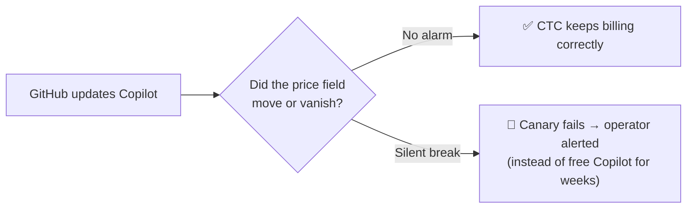
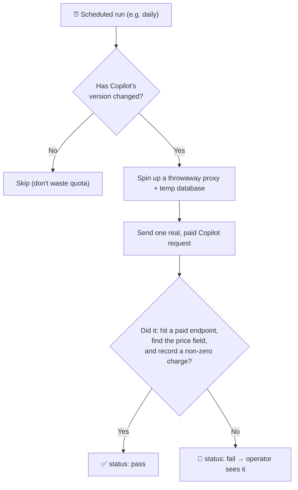

# 06 · Drift detection — the early-warning system

> CTC depends on details it *reverse-engineered* from GitHub's Copilot CLI. If
> GitHub changes those details in an update, CTC could break **silently**. This
> system is the smoke alarm. Code: `ctc/contract.py`, `ctc/sentinel.py`,
> `ctc/canary.py`, `tools/canary.py`.

---

## Layer 1 — The danger it guards against

CTC reads the price of each request from one specific spot in GitHub's response:
`copilot_usage.total_nano_aiu` ([see 01](01-the-proxy.md)). GitHub updates Copilot
regularly, without telling anyone.

**The nightmare scenario:** an update renames or moves that price field. CTC keeps
working — requests go through, answers come back — but now it reads *no price*,
so **every request is recorded as costing 0**. Everyone uses Copilot for free,
the givers' real quota drains, and **nothing looks wrong**. No error, no alert.

Drift detection exists to make that impossible to miss.

---

## Layer 2 — Two layers of defence

### 1. The Sentinel — always watching live traffic (passive)

While the Proxy runs, the **sentinel** quietly checks every billable response and
raises a flag if something looks wrong. It has three checks:

| Check | Fires when… | Means |
|---|---|---|
| **Silent-billing** | a paid request returns `200` but the price field is missing | the metering field drifted — the core nightmare |
| **Bypassed-host** | a GitHub-ish host slips through *without* being inspected | a new Copilot endpoint appeared that CTC doesn't know about |
| **Billable-rejected** | a paid request comes back `400/401/403` | the request format drifted (e.g. auth scheme changed) |

The clever bit is telling **"GitHub genuinely priced this at 0" apart from
"broken"**. Both look like "price is 0" to a naive reader. So the sentinel uses a
three-way classifier:

- **present & positive** → the price field is there with a value > 0. Working fine.
- **present & zero** → the field is there and says `0`. A real, valid 0-cost
  request (CTC charges nothing for it). Normal — no alarm.
- **absent** → the field is missing entirely. **This is the alarm.**

(Note: "0-cost" is GitHub's per-request call, not a fixed list of free models —
CTC just records whatever number is there.)

The sentinel is wired in so that **even if one of its checks crashes, it can
never affect the actual Copilot response** — it only observes and logs.

### 2. The Canary — a deliberate live test (active)

The sentinel only sees traffic that happens to flow. The **canary** doesn't wait:
on a schedule, it sends a *known, paid* request all the way through and checks
that money was actually counted.

**Where it runs (important):** the canary is **not** part of the production
proxy, and it does not reach into anyone's machine. It's a standalone program the
operator runs on a box that **has Copilot CLI installed** (e.g. the operator's
own machine). Think of it as a **robot test-user**: it reads `copilot --version`
locally, stands up its *own* throwaway mini-proxy + temporary database (separate
from production), and drives its *local* Copilot through that — purely to check
the pipeline still bills correctly. (The **sentinel**, by contrast, *is* code
inside the live proxy and needs no Copilot — it just watches real traffic.)

It only bothers when **Copilot's version actually changed** (no point spending
real quota otherwise), and it cleans up after itself.

---

## Layer 3 — Under the hood

### One source of truth: `ctc/contract.py`

Everything CTC "knows" about Copilot's shape lives in one file: the hosts it
inspects, the billable endpoints/method, the **name and location of the price
field**, and which hosts *should* be inspected. The Proxy, the metering reader,
the sentinel, and the canary all import from here — so there's exactly one place
to update when GitHub changes, and one place the alarms compare against.

### The sentinel (`ctc/sentinel.py`)
Pure functions returning a "finding" or nothing:
`check_billable_response`, `check_bypassed_host`, `check_billable_rejection`,
plus `classify_usage` (the three-way present-positive / present-zero / absent
classifier). They're called from the Proxy through a guard (`_safe_sentinel_emit`)
that swallows any exception so a detector bug can't disturb live traffic. The
checks run *after* the response has already been sent to the user.

### The canary (split in two)
- **`ctc/canary.py`** — the *pure* verdict logic: given the captured exchanges
  and the amount that got debited, it asserts (1) a paid request happened,
  (2) the price field was present, (3) a non-zero charge was recorded end-to-end,
  (4) no unexpected host was contacted. Fully tested with fixtures — no real quota
  needed.
- **`tools/canary.py`** — the *live* runner (operator-only): handles the
  scheduling, version-skip, the throwaway proxy/cert/temp-database, sending a
  real request, and writing a status file. It costs a little real quota, so it's
  intentionally run by the operator, not in automated tests.

### Operator setup
The live canary needs a one-time setup: a scoped `sudo` rule for trusting its
temporary cert, a confirmed **paid** model in `CANARY_MODEL`, and a dedicated
`CANARY_PAT`. Full runbook: [`TDD.md`](../../TDD.md) §14.

> ### ⚠️ TODO — the live canary isn't finished yet
> The **verdict logic** (`ctc/canary.py`) is complete and tested, but the
> **live runner** (`tools/canary.py`) is still a skeleton: the step that drives
> the real `copilot` binary non-interactively is a **stub**, and the cert-trust
> path is **macOS-only**. So the canary can't actually run end-to-end yet — it
> needs that invocation finished (and validated against a real Copilot install)
> before it's a turnkey monitor. (The always-on **sentinel** already works; only
> the active canary is pending.)

---

That's the whole onion. Back to the [Guide index](00-overview.md) or the
[top-level README](../../README.md).
