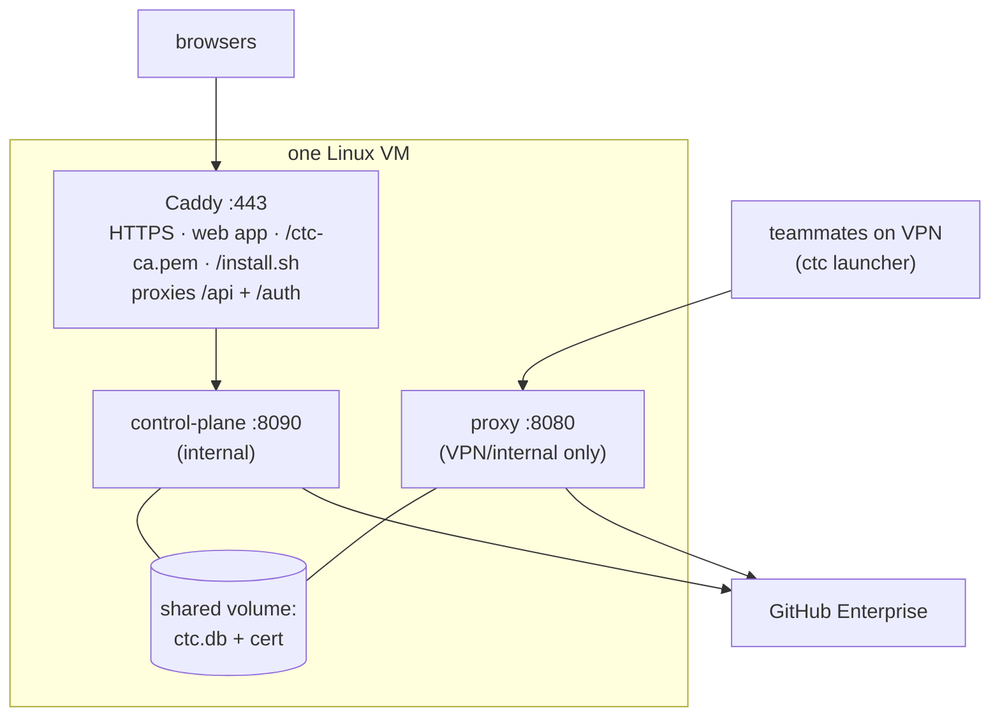

# 07 · Deploying CTC (single VM)

> A practical runbook for shipping CTC to one Linux VM with `docker compose`.
> It runs all three pieces + the shared database, with automatic HTTPS.

---

## Layer 1 — The shape of a deployment

One VM runs three containers that share one database:



- **Caddy** is the only thing on the public internet (ports 80/443). It serves the
  web app, hands out the CA cert + installer, and forwards API/auth calls inward.
- The **control-plane** is internal — only Caddy talks to it.
- The **proxy** is **VPN/internal only** — never public (see the security note).
- All three share one **SQLite database** on a Docker volume. (This is why it's a
  single VM: SQLite can't be shared across machines.)

---

## Layer 2 — One-time setup

You need, before you start:

1. **A VM** with Docker + the Docker Compose plugin, reachable by your team on
   ports **80/443** (web) and **8080** (proxy). A public domain is **optional** —
   a raw internal IP works too (see "Internal server with no domain" below).
2. **A GHE OAuth app** registered on your GitHub Enterprise, with the callback URL
   `https://<CTC_DOMAIN>/auth/callback` (where `<CTC_DOMAIN>` is your hostname *or*
   IP, e.g. `https://10.0.0.5/auth/callback`).
3. **A VPN / private network** your teammates are on (the proxy binds to it).

Then:

```bash
# 1. Configure
cp .env.example .env
#    edit .env — set CTC_DOMAIN, CTC_SECRET_KEY (openssl rand -hex 32),
#    GHE_DOMAIN (your real GitHub Enterprise domain, e.g. example.ghe.com),
#    the GHE_OAUTH_* values, and PROXY_BIND (your VM's VPN-facing IP).
#
#    For example, the GHE values might be:
#      GHE_DOMAIN=example.ghe.com
#      GHE_OAUTH_BASE=https://example.ghe.com
#      GHE_API_BASE=https://api.example.ghe.com
#      REAL_GHE_HOST=api.example.ghe.com

# 2. Generate the proxy's MITM certificate (once — reads GHE_DOMAIN for the SANs)
docker compose --profile tools run --rm gencert

# 3. Build + start everything
docker compose up -d --build
```

That's it — Caddy fetches a Let's Encrypt cert automatically, and the database is
created/migrated on first start.

### What each `.env` value is for

| Variable | Meaning |
|---|---|
| `CTC_DOMAIN` | **The one host knob** — a hostname *or* a raw IP. Sets the web/API origin and is the source the CLI install command, the proxy host, and the launcher's default all derive from. `localhost` for a local test. |
| `CTC_SECRET_KEY` | One secret, shared by proxy + control-plane. Encrypts stored PATs, signs cookies. **Never change it** once set (it would orphan stored PATs). |
| `GHE_DOMAIN` | Your GitHub Enterprise domain (e.g. `example.ghe.com`). The proxy derives the hosts it decrypts + the cert SANs from this; the CLI launcher uses it for `GH_HOST`. The code default is the neutral placeholder `example.ghe.com` — override it here. |
| `GHE_OAUTH_CLIENT_ID` / `_SECRET` | Your GHE OAuth app credentials. |
| `GHE_OAUTH_BASE` | GHE **web** host (login). |
| `GHE_API_BASE` | GHE **API** host (Copilot quota lives here). |
| `REAL_GHE_HOST` | API host the proxy forwards Copilot traffic to. |
| `PROXY_BIND` | The VM's **VPN-facing IP** for port 8080. Keep proxy off the public internet. |
| `CTC_ADMINS` | Comma-separated GHE logins that get the admin panel (all users, PAT reveal, runtime defaults). Case-insensitive. Lock down like a secret — an admin can reveal any giver's PAT. Empty = no admin. |

---

## Layer 2 — Internal server with no domain (raw IP)

Deploying to an internal box your team reaches by IP? You don't need a domain.
Everything keys off `CTC_DOMAIN`, so just set it to the IP:

```bash
CTC_DOMAIN=10.0.0.5          # your server's internal IP (web + proxy live here)
GHE_DOMAIN=example.ghe.com
PROXY_BIND=10.0.0.5          # bind the proxy to the same internal interface
# …plus CTC_SECRET_KEY, GHE_OAUTH_* as usual
```

Then `docker compose --profile tools run --rm gencert && docker compose up -d --build`
as normal. With an IP, **Caddy can't get a Let's Encrypt cert** (those are
domain-only), so it serves HTTPS using its **own internal CA**. That's fine — it's
real HTTPS — but nothing trusts that CA yet, which means two one-time trust steps:

1. **OAuth callback:** register `https://10.0.0.5/auth/callback` in your GHE OAuth
   app (your GHE admin must allow a non-public callback host).
2. **Trust Caddy's CA on each machine.** Until it's trusted, the browser warns on
   `https://10.0.0.5`, and the `curl -fsSL https://10.0.0.5/install.sh …`
   one-liner fails cert verification. Distribute Caddy's root CA to the team and
   have them add it to their system trust store. Grab it from the running
   container:

   ```bash
   docker compose exec caddy \
     cat /data/caddy/pki/authorities/local/root.crt > ctc-internal-ca.crt
   ```

   (Quick, less-clean alternative: teammates click through the browser warning and
   add `-k` to the install `curl`. Trusting the CA once is cleaner.)

Note this is a *separate* cert from the proxy's MITM cert that `ctc login` trusts:
Caddy's CA secures the **website**; the proxy cert secures the **Copilot traffic**.
On a raw-IP deploy teammates end up trusting both (the proxy one is automatic
inside `ctc login`).

Prefer not to deal with the CA at all? Ask whoever runs your **internal DNS** for a
name (e.g. `ctc.corp.company.com`) pointing at the VM and use that as `CTC_DOMAIN`
— same deploy, nicer URL, and HTTPS still via Caddy's internal CA (or a real cert
if the name is a public subdomain).

---

## Layer 2 — Before you go live (checklist)

Don't invite the team until all of these pass. The first four are setup; the last
one is the real proof — the tests cover the parts, not the live wiring.

- [ ] **GHE OAuth app registered** with the exact callback `https://<CTC_DOMAIN>/auth/callback`,
      and `GHE_OAUTH_CLIENT_ID` / `_SECRET` set in `.env`. (A mismatched callback is
      the #1 cause of a broken login.)
- [ ] **`CTC_SECRET_KEY` generated** (`openssl rand -hex 32`) and stored safely.
      **Never change it** once givers have uploaded PATs — it would orphan them.
      Also set **`CTC_ADMINS`** to the operator GHE login(s) — an admin can reveal
      any giver's PAT in cleartext, so treat it like a secret and keep the list short.
- [ ] **Proxy locked down** — `PROXY_BIND` on the VPN/internal interface and port
      **8080 firewalled** from the public internet. It blind-tunnels unknown hosts,
      so a public proxy is an open relay.
- [ ] **Cert trust sorted** — real domain: nothing to do (Let's Encrypt). Raw IP /
      internal name: distribute Caddy's internal CA to the team (see the raw-IP
      section above) so the browser and the install `curl` trust the site.
- [ ] **One real end-to-end run passes** (the smoke test below).

### The smoke test — prove the live flow once

Run this yourself with **two** GHE accounts (or one giver + one teammate) before
handing it out. It exercises the whole chain the unit tests can't.

**As a giver:**
1. Open `https://<CTC_DOMAIN>`, log in with GitHub Enterprise → you land in the
   first-run walkthrough.
2. Choose **giver**, paste a real Copilot PAT → it should verify (`✓ belongs to
   @you · N AIU`) and read your quota. Set a pledge. Copy the install one-liner.
3. Run the one-liner, then `ctc -p "say hello"`. Confirm you get a **real Copilot
   reply** (not an auth/cert error).
4. Back on the dashboard, confirm your **usage went up** and credit was **debited**
   (the cost is read from Copilot's response, in nano-AIU).

**As a consumer (second account):**
5. Log in, choose **consumer**, finish onboarding (you get the free allowance).
   Install + `ctc -p "…"`.
6. Confirm the request **routes through a giver's PAT** (charged to the giver, not
   you) and the **leaderboard / dashboard update** to reflect it.

If steps 3–4 and 6 pass, the live wiring is good. If `ctc` errors on TLS, the cert
isn't trusted (see cert trust above); if login bounces, re-check the OAuth callback.

---

## Layer 2 — How teammates connect afterwards

Once it's up, a teammate:

1. opens `https://<your-domain>`, logs in with GitHub, and is walked through a
   short **first-run setup** (or later, the Settings → "Set up CLI" panel) that
   hands them a ready-to-run install one-liner with their token baked in;
2. runs that one-liner —
   `curl -fsSL https://<your-domain>/install.sh | sh -s -- --token <their-token>` —
   which installs `ctc` **and** logs in (downloads + trusts the cert) in one step,
   then runs `ctc` to use Copilot.

See [02 · The `ctc` command](02-the-cli-launcher.md) for that side.

---

## Layer 3 — Operating it

- **Logs:** `docker compose logs -f proxy` / `controlplane` / `caddy`.
- **Update to a new version:** `git pull && docker compose up -d --build`.
  (Also redeploy to the **canary** box if it runs separately — see
  [06 · Drift detection](06-drift-detection.md).)
- **Backups:** the only state is the `ctcdata` volume (the SQLite DB). Snapshot it
  regularly — it holds users, encrypted PATs, and all credit history.
- **The cert:** `cert.pem`/`key.pem` live in the `ctccerts` volume. Don't
  regenerate casually — every client trusts it via `ctc login`, so a new cert
  means everyone must re-run `ctc login`.

### ⚠️ Security notes (read these)

- **The proxy must never be public.** It's an HTTP `CONNECT` proxy; for hosts it
  doesn't inspect it blind-tunnels, which on the open internet is an **open
  relay**. Keep `PROXY_BIND` on a VPN/internal interface and firewall port 8080.
- **`CTC_SECRET_KEY` and `.env` are secrets.** `.env` is gitignored; keep it off
  git and out of images. Treat the `ctcdata` volume as sensitive (it contains
  encrypted PATs — encrypted, but still).
- **HTTPS is required for login.** Session cookies are `Secure` and the OAuth
  redirect is `https`, so the control-plane must be reached over HTTPS (Caddy
  handles this for a real domain).

---

## Layer 3 — Running across multiple servers? Not yet.

This kit is deliberately single-VM because the proxy and control-plane share one
**SQLite** file. To scale horizontally you'd move the accounting/auth store to a
networked database (e.g. Postgres) and run the services on separate hosts — a
real change to `ctc/store/`, out of scope here. For a team-sized internal tool,
one well-sized VM is plenty.

---

That's the whole picture, front to back. Back to the [Guide index](00-overview.md).
